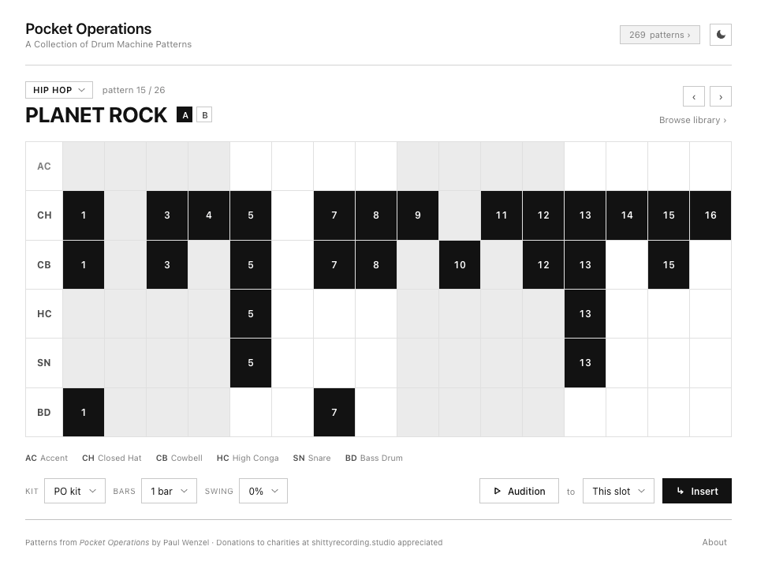
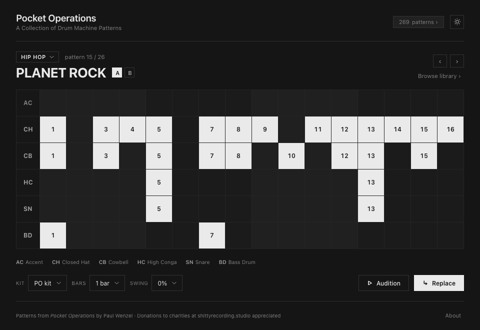
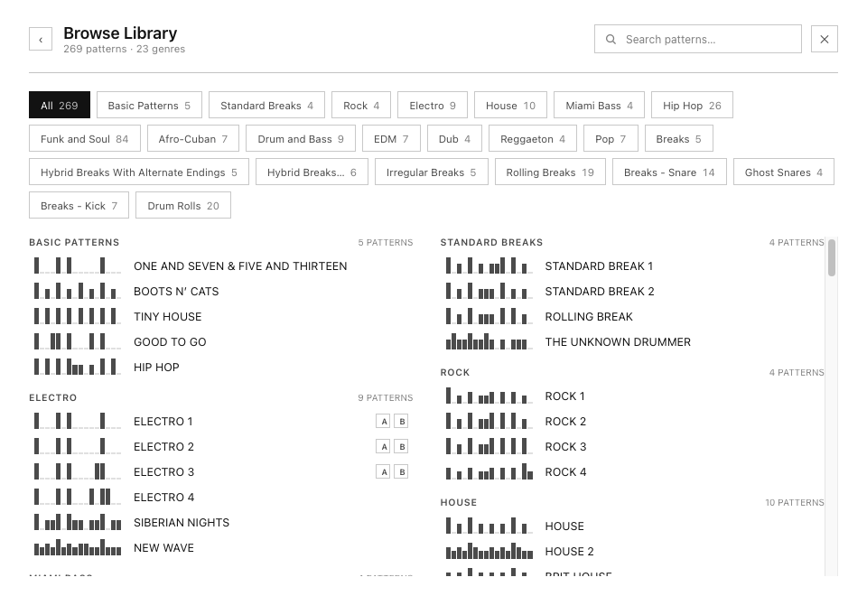
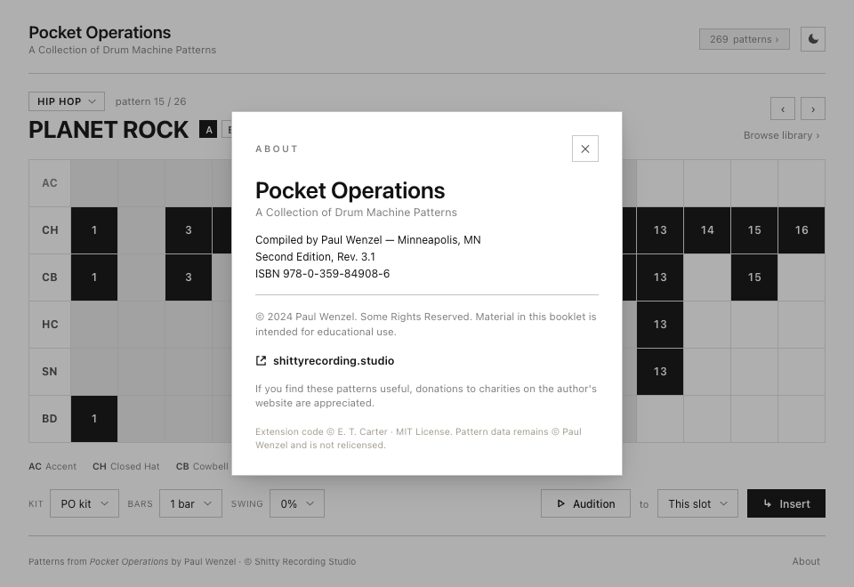

# Pocket Operations — Ableton Live extension

A right-click drum-pattern library for Ableton Live 12, built on the official
Extensions SDK. Browse the classic drum-machine patterns from Paul Wenzel's
*Pocket Operations* booklet, edit them on a 16-step grid, and drop them as MIDI
clips onto a Drum Rack track.

## Screenshots

| Browse & edit (light) | Dark theme |
| --- | --- |
|  |  |

| Browse by genre | About & credits |
| --- | --- |
|  |  |

## What it does

Right-click a clip slot, clip, or Drum Rack track → **Pocket Operations** opens a
modal dialog where you can:

- **Browse 269 patterns** from the booklet, grouped by genre, with a density
  sparkline per pattern and A/B variant chaining.
- **Edit the step grid** — toggle hits, accents, and ratchets across the 16
  steps, per instrument row.
- **Pick a kit** — Erin's PO chromatic kit or General MIDI.
- **Set bars (1 / 2 / 4) and swing** (0–65% of max 16th-swing).
- **Audition** the result through a self-contained Web Audio synth preview
  (no Live playback needed) before committing.
- **Insert / Replace** the pattern as a MIDI clip into the clicked slot, a new
  clip, or the track.
- **Light / dark theme**, persisted across sessions.

## Status

- **P0 — pattern data** ✅ 269 patterns extracted from the booklet PDF by
  geometric cell-detection (the filled black square is the data). See
  [`scripts/README.md`](scripts/README.md). 100% digit self-consistency; 92%
  rhythm-match vs the hand-built `.als` cross-check.
- **P1 — pure logic** ✅ `src/mapping.ts`, `src/grid.ts`, `src/patternbank.ts`
  with full unit tests (`npm test`). No SDK dependency; runs on plain Node.
- **Dialog UI** ✅ grid editor, genre browser, kit / bars / swing controls,
  Web Audio audition, light / dark themes (`src/webview/`).
- **Host wiring** ✅ inserts / replaces the edited pattern as a MIDI clip on a
  Drum Rack via the Extensions SDK.

## Develop

```sh
nvm use            # node 24
npm install
npm test           # vitest
npm run typecheck
```

## Modules (P1)

- **`mapping.ts`** — instrument codes → MIDI pitch, two kits (Erin's PO chromatic
  kit, General MIDI) + canonical row order.
- **`grid.ts`** — the 16-step grid model and `gridToNotes` / `notesToGrid`
  (accents, ratchets, swing, A/B bar chaining).
- **`patternbank.ts`** — loads `data/patterns.json`; search, genre grouping,
  variant chains, density sparkline data.

## Licensing

Code is MIT (© E. T. Carter). The pattern **data** is © Paul Wenzel
(*Pocket Operations*, Some Rights Reserved) and is **not** relicensed — see
[`ATTRIBUTION.md`](ATTRIBUTION.md). The data is redistributed with Paul Wenzel's
permission (granted by email, 2026-06-30).

## Support

If you find these patterns useful, donations to charities on the author's
website (<https://shittyrecording.studio>) are appreciated.
